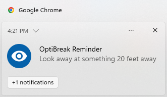
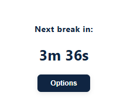
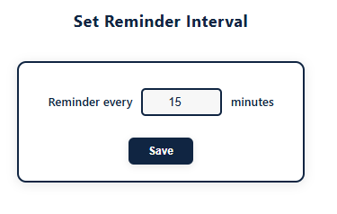

# OptiBreak

OptiBreak is a Chrome extension designed to help you maintain healthy screen habits. It reminds you to take a short break every 20 minutes, encouraging you to look away from your screen for 20 seconds. This follows the popular "20-20-20" rule, which helps reduce eye strain and improve productivity.

## Features

- **Automatic Reminders:** Get a notification every 20 minutes.
- **Simple Timer:** Each notification prompts you to look away for 20 seconds.
- **Easy to Use:** Install and forget—OptiBreak works in the background.

## Installation

1. Download or clone this repository.
2. Open Chrome and go to `chrome://extensions/`.
3. Enable "Developer mode" (top right).
4. Click "Load unpacked" and select the extension's directory.

## Usage

Once installed, OptiBreak will automatically send you a notification every 20 minutes while Chrome is running. When you see the notification, take a 20-second break and look at something 20 feet away.

## Screenshots

## Why OptiBreak?

Prolonged screen time can cause eye strain and fatigue. The 20-20-20 rule is a simple way to protect your eyes and improve your well-being. OptiBreak helps you stick to this habit effortlessly.

## License

MIT License
